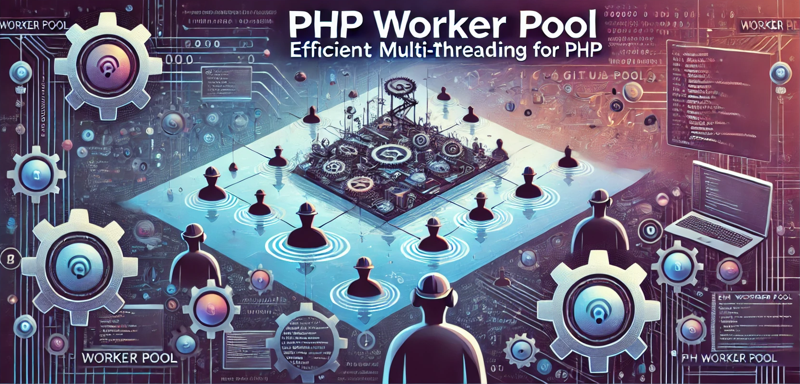

# PHP Worker Pool 


[](https://codecov.io/gh/white-rabbit-1-sketch/php-worker-pool)



A lightweight PHP library for managing worker pools with shared memory and task queues using **System V Message Queues** and **Redis**.

## Features

- **System V Message Queues** for efficient inter-process communication.
- **Redis Queue** for scalable, networked message handling.
- Simple worker pool implementation using process forking.
- Supports closures and custom task implementations via `TaskInterface`.
- Graceful handling of blocking operations.
- Lightweight and optimized for CLI usage.
- Queue easily extendable: implement custom queues with any storage system (e.g., Redis, databases) by extending the `QueueInterface`.
- Task types are extendable: simply implement the `TaskInterface` to create custom task types.
- Two queue options: **SysV Message Queues** and **Redis Queue**.
- Two working modes: **Infinite Loop** and **Fixed Loop** (process tasks until the queue is empty).
---

⭐️ Star the Project

If you found this project useful, please consider giving it a star! 🌟 Your support helps improve the project and motivates us to keep adding new features and improvements. Thank you! 🙏

---

### Table of Contents

1. [Features](#features)
2. [Quick Start](#quick-start)
   - [Installation](#installation)
   - [Examples](#examples)
      - [SysV Queue (Infinite Loop)](#example-for-sys-v-queue-with-infinite-loop)
      - [Redis Queue (Infinite Loop)](#example-for-redis-queue-with-infinite-loop)
      - [SysV Queue (Fixed Loop)](#example-for-sys-v-queue-with-fixed-loop)
      - [Redis Queue (Fixed Loop)](#example-for-redis-queue-with-fixed-loop)
3. [Queue Types](#queue-types)
   - [SysV Message Queues](#1-sysv-message-queues)
   - [Redis Queue](#2-redis-queue)
   - [Creating Custom Queues](#3-creating-custom-queues)
4. [Modes of Operation](#modes-of-operation)
   - [Infinite Loop (Default)](#1-infinite-loop-default-mode)
   - [Fixed Loop](#2-fixed-loop)
5. [How It Works](#how-it-works)
   - [System V Queues](#key-features-of-system-v-message-queues)
   - [Queue Implementation](#queue-implementation)
6. [Who This Library Is For](#who-this-library-is-for)
   - [Why Choose This Library?](#why-choose-this-library)
   - [Use Cases](#use-cases)
   - [Comparison with Other Solutions](#comparison-with-other-solutions)
7. [Author and License](#author-and-license)

## Quick Start

## Installation

To install the PHP Worker Pool library, use Composer:

1. If you haven't already, install [Composer](https://getcomposer.org/download/) on your system.
2. Run the following command to install the library:

```bash
composer require white-rabbit-1-sketch/php-worker-pool
```

### Examples

Example for Sys V Queue with infinite loop:

```php
<?php

use PhpWorkerPool\ClosureTask;
use PhpWorkerPool\Pool;
use PhpWorkerPool\Queue\SysVQueue;

require_once "../vendor/autoload.php";

$queue = new SysVQueue(1234567);

$pool = new Pool($queue);
$pool->start();

for ($i = 0; $i < 20; $i++) {
    $queue->push(new ClosureTask(function () {
        echo microtime() . PHP_EOL;
        sleep(1);
    }));
}

$pool->wait();
$pool->stop();
```

Example for Redis Queue with infinite loop:

```php
<?php

use PhpWorkerPool\ClosureTask;
use PhpWorkerPool\Pool;
use PhpWorkerPool\Queue\RedisQueue;
use Predis\Client as RedisClient;

require_once "../vendor/autoload.php";

$redisClient = new RedisClient([
    'scheme' => 'tcp',
    'host'   => 'localhost',
    'port'   => 6379,
]);
$redisClient->connect();
$queue = new RedisQueue($redisClient, "test-queue", 123);

$pool = new Pool($queue);
$pool->start();

for ($i = 0; $i < 20; $i++) {
    $queue->push(new ClosureTask(function () {
        echo microtime() . PHP_EOL;
        sleep(1);
    }));
}

$pool->wait();
$pool->stop();
```


Example for Sys V Queue with fixed loop:

```php
<?php

use PhpWorkerPool\ClosureTask;
use PhpWorkerPool\Pool;
use PhpWorkerPool\Queue\SysVQueue;

require_once "../vendor/autoload.php";

$queue = new SysVQueue(1234567);

$pool = new Pool($queue, infinite: false);

for ($i = 0; $i < 20; $i++) {
    $queue->push(new ClosureTask(function () {
        echo microtime() . PHP_EOL;
        sleep(1);
    }));
}

$pool->start();
$pool->wait();
$pool->stop();
```

Example for Redis Queue with fixed loop:

```php
<?php

use PhpWorkerPool\ClosureTask;
use PhpWorkerPool\Pool;
use PhpWorkerPool\Queue\RedisQueue;
use Predis\Client as RedisClient;

require_once "../vendor/autoload.php";

$redisClient = new RedisClient([
    'scheme' => 'tcp',
    'host'   => 'localhost',
    'port'   => 6379,
]);
$redisClient->connect();
$queue = new RedisQueue($redisClient, "test-queue", 123);

$pool = new Pool($queue, infinite: false);

for ($i = 0; $i < 20; $i++) {
    $queue->push(new ClosureTask(function () {
        echo microtime() . PHP_EOL;
        sleep(1);
    }));
}

$pool->start();
$pool->wait();
$pool->stop();
```

---

## Queue Types

The library provides **two queue types** that you can use to store and manage tasks:

### 1. **SysV Message Queues**
- **System V Message Queues** provide a simple, in-memory message-passing mechanism for inter-process communication. They are a great choice for tasks that need to be processed on the same system without requiring external services like Redis.
- Tasks are serialized before being added to the queue, and they are deserialized when retrieved by workers.
- **Pros**: Simple to set up, minimal dependencies (requires `sysvmsg` PHP extension), very fast for local, intra-machine communication.
- **Cons**: Limited to the local machine, not suitable for distributed systems.
- **Queue Persistence**: Queues are persistent across reboots until they are explicitly removed by the system or through code.

**Key Features**:
- **Isolation**: Each queue is uniquely identified by a key, ensuring that messages are isolated between different queues.
- **Concurrency**: Multiple worker processes can simultaneously consume tasks from the queue, making it suitable for high concurrency.

### 2. **Redis Queue**
- **Redis** is a highly scalable, distributed key-value store, often used as a message broker for queues. Redis queues allow tasks to be managed across multiple machines and can support high availability and fault tolerance.
- The library provides a simple interface to interact with Redis lists (`LPUSH` for pushing tasks and `RPOP` for pop operations).
- **Pros**: Highly scalable, networked queues, supports multiple workers across different machines, persistent storage.
- **Cons**: Requires a running Redis instance, more complex setup for distributed systems.
- **Queue Persistence**: Tasks in Redis queues persist across restarts, ensuring reliability in distributed systems.

**Key Features**:
- **Scalability**: Redis allows task queues to be managed across different machines, making it a good choice for distributed systems.
- **Redis Pub/Sub**: You can extend redis queue to get support for advanced scenarios involving integrating Redis' pub/sub features to notify workers of new tasks.

### 3. **Creating Custom Queues**

While the library comes with two built-in queue implementations (SysV and Redis), it is also flexible enough to allow you to create your own custom queue. You can implement a queue using any storage mechanism that you prefer (e.g., databases, files, etc.).

## Modes of Operation

This library supports **two operating modes** for processing tasks in the queue:

### 1. **Infinite Loop (Default Mode)**
- The worker pool will keep processing tasks **indefinitely** until it is explicitly stopped.
- Ideal for long-running processes where new tasks are added continuously to the queue.
- This mode is typically used in **daemon**-like applications.

### 2. **Fixed Loop**
- The worker pool will process a **fixed number of tasks** (until the queue is empty) and then stop.
- This mode is useful when you want the worker pool to process a set of tasks and then exit.
- For example, you may want to run a worker pool for a single job batch or when you don't want workers running indefinitely.

## How It Works

The library leverages **System V message queues** (using the `sysvmsg` PHP extension) or **Redis** to enable efficient communication between processes. Each queue is identified by a unique key and allows processes to exchange serialized messages.

### Key Features of System V Message Queues

- **Isolation**: Each queue is uniquely identified by a key, ensuring data integrity between different queues.
- **Persistence**: Queues persist in the operating system until explicitly removed or the system is rebooted.
- **Concurrency**: Multiple processes can read from and write to the queue simultaneously, making it ideal for worker pools.

### Queue Implementation

- **Adding Tasks**: Tasks are serialized and added to the queue using `msg_send` for SysV or `lpush` for Redis. The library ensures compatibility with closures via the `opis/closure` library, allowing complex callable structures to be safely serialized and deserialized.
- **Retrieving Tasks**: Workers fetch tasks from the queue using `msg_receive` for SysV or `rpop/brpop` for Redis, ensuring that each task is processed only once.

---

## Who This Library Is For

The PHP Worker Pool library is designed for developers who need a **lightweight**, **efficient**, and **simple** solution for parallel task processing in PHP applications. Unlike existing solutions that require complex infrastructure setups, such as supervisors, message brokers (e.g., RabbitMQ), databases, or dedicated workers (e.g., Symfony Messenger), this library provides a **straightforward** and **lightweight** approach to task parallelism.

### Why Choose This Library?

1. **Minimal Infrastructure Requirements**  
   Unlike solutions like Symfony Messenger, which rely on external systems like RabbitMQ, database queues, or a distributed message broker, this library operates entirely within PHP processes using **System V Message Queues** or **Redis queues**. There's no need to set up complex messaging infrastructure, run external services, or manage dedicated workers.

2. **Ease of Setup and Maintenance**  
   This library can be integrated into PHP applications with minimal configuration changes. It leverages **System V Message Queues** or **Redis** as a local inter-process communication mechanism, allowing you to start processing tasks with just a few lines of code. Perfect for small to medium-scale PHP applications where complex systems like Supervisors, microservices, or heavy infrastructure are overkill.

3. **High Performance and Low Overhead**  
   By forking worker processes once and reusing them, this library allows you to manage task processing with minimal context switching and overhead. The task queue is managed directly within the PHP process space, resulting in faster task processing and lower memory consumption compared to traditional PHP worker pools that rely on external systems.

4. **Scalable and Efficient Local Task Processing**  
   For many PHP applications, local task processing (e.g., within a single server or a set of PHP CLI scripts) is sufficient. This library is perfect for scenarios where the PHP environment can handle concurrency and resource management without the need for a distributed queue system.

5. **Lightweight Parallel Processing**  
   This library strikes a balance between **lightweight parallel processing** and task isolation. It is ideal for scenarios where tasks need to run in parallel but don’t require distributed coordination, cross-process messaging, or high-level task execution guarantees.

6. **Limited but Focused Flexibility**  
   Compared to more sophisticated solutions like RabbitMQ or Symfony Messenger, this library’s task processing model is more restrictive. It does not offer complex message routing, event listeners, or asynchronous messaging. However, it is perfect for straightforward task processing like handling I/O-bound operations, background data processing, file generation, or network requests.

7. **Use Cases**:
    - **Short-lived tasks** that don’t require persistent state across runs (e.g., file processing, HTTP request handling, data transformations).
    - **Small-scale parallel tasks** in PHP CLI scripts (e.g., running parallel data processing operations).
    - **Local task queues** where tasks are processed in the same process space.
    - **Cron jobs** or background processing tasks where simple task coordination and local memory access are sufficient.

### Comparison with Other Solutions

- **Symfony Messenger**: Symfony Messenger is excellent for complex messaging workflows with multiple consumers, message retries, and various transport layers (e.g., RabbitMQ, database queues). However, setting up a Symfony Messenger environment requires complex configuration, external messaging infrastructure (e.g., RabbitMQ, Redis), and managing persistent messages. Our library, on the other hand, can operate with minimal configuration using either **System V Message Queues** or **Redis**, and it doesn’t require managing external systems.

- **Task Scheduling with Supervisor**: Solutions like PHP's Supervisor are useful for running long-running processes that require process monitoring, logging, and resource isolation. However, these setups are heavier and often unnecessary for short-lived tasks that our library can handle directly using local process concurrency. With this library, you can easily manage processes using system-level process isolation without needing external services.

- **Task Processing in Microservices Architecture**: For applications with a distributed architecture that requires inter-process messaging and coordination (e.g., microservices communicating across different services in a cluster), our library might not be the best fit. The **System V Message Queue** and **Redis Queue** are local, not distributed, and our library’s primary focus is local parallel task processing within a single PHP environment.

- **Command Line Applications and CLI Scripts**: Our library is ideal for CLI scripts, command-line applications, and background data processing tasks that require local, lightweight task processing. It can easily be used in combination with PHP CLI commands to offload resource-intensive operations (e.g., file processing, data crunching) from the main PHP process.

### Summary

By choosing this library, developers can take advantage of **high-performance task processing** with **minimal configuration overhead**, **local resource management**, and **efficient concurrency**, without the need to rely on external systems or complex message queues. This makes it an ideal choice for many PHP-based applications looking for simple, efficient, and lightweight task processing.

## Author and License

**Author**: Mikhail Chuloshnikov

**License**: MIT License

This library is released under the MIT License. See the [LICENSE](LICENSE) file for more details.
